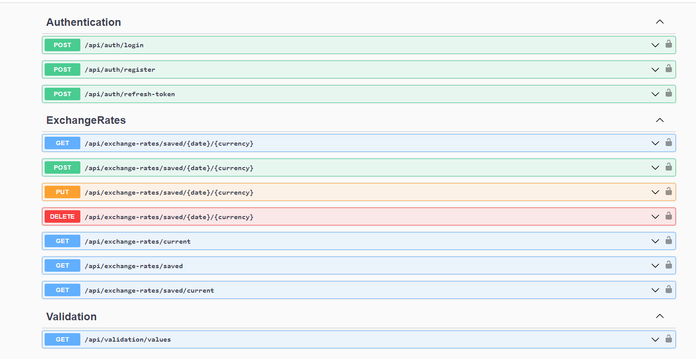
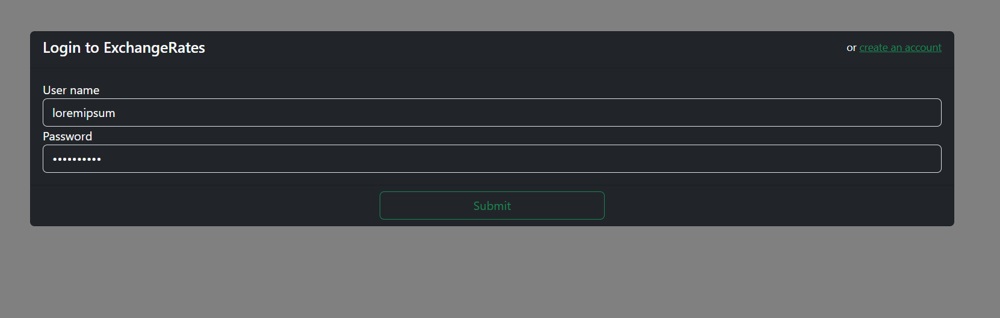
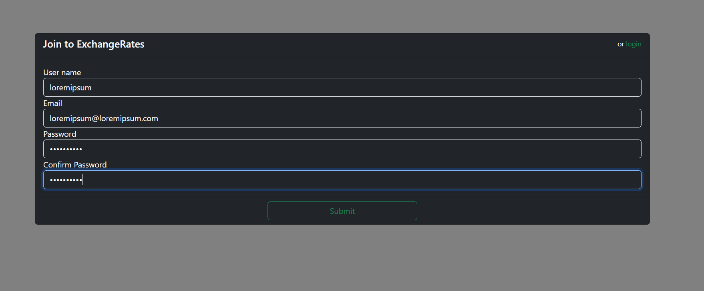
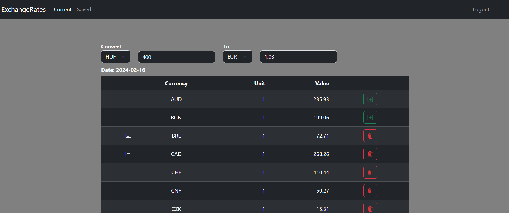
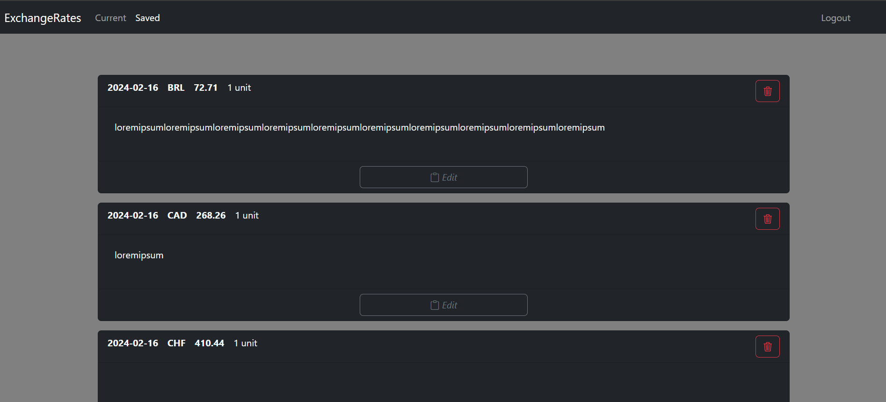

# WSH_HomeAssignment
## Feladat
A feladat, hogy készíts egy mini site-ot, backendként .NET Core WebAPI-t, adatbázisként MSSQL-t használva, Angular frontenddel.

 

Az alábbi funkciókat kérjük megvalósítani:

* Bejelentkezés

* User regisztráció

* Bejelentkezett oldal funkciói:

    - Jelenítse meg az MNB interfészéről (https://www.mnb.hu/arfolyamok.asmx) lekérdezhető árfolyamokat egy táblázatban. Az oldalon lehessen az egyes árfolyamok aktuális állapotát elmenteni adatbázisba egy opcionális megjegyzéssel.

    - Mini form, ahol megadott input adatra (forint összeg) kiírja a program az annak megfelelő EUR összeget.

    - Egy oldal, ami megjelenít egy listát elmentett árfolyamokról, és szerkeszteni lehet a megjegyzést, és törölni a rekordokat. Az alábbi adatokat kérjük elmenteni:
        - Mentés időpontja
        - Valuta
        - Érték
        - Megjegyzés (szöveges, nem kötelező, max. 100 karakter)
        
## Működtetés
### Backend
Az API megfelelő működéséhez létre kell hoznunk az adatbázist, ehhez szükségünk van [.NET CLI](https://learn.microsoft.com/en-us/dotnet/core/tools/)-re és egy minimum egy 7.0.16-s verzió számú [dotnet-ef](https://learn.microsoft.com/en-us/ef/core/cli/dotnet) fejlesztői eszközre.

Telepítés
```
dotnet tool install --global dotnet-ef --version 7.0.16
```
vagy
Frissítés
```
dotnet tool update --global dotnet-ef --version 7.0.16
```
Adatbázis létrehozása (gyökérkönyvtár).
```
dotnet-ef database update --project WSH_HomeAssignment.Infrastructure
```
### Frontend
Kliens futtatásához szükségünk van az [NPM](https://docs.npmjs.com/cli/v8/commands/npm-install) csomagkezelőre és az [Angular CLI](https://angular.io/cli)-re.

Függőségek telepítése (/WSH_HomeAssignment.Client)
```
npm install
```

Kliens indítása (/WSH_HomeAssignment.Client)
```
ng serve
```


## API

## Frontend
### /login

### /registration

### / (home)

### /saved


## Hiányosságok/Észrevételek
### Backend
- nincsenek unit(MNBXmlParser kívételével), illetve integrációs tesztek
- nincs dokumentáció
- nincs loggolás
- nincs auditálás
- gyenge jelszókövetelmények
- secretek/paraméterek jöhetnének környezeti változókból és nem beleégetve a config fájlba
- nincs virtualizáció / konténerizáció
- [CurrentExchangeRatesRequester](https://github.com/Beres0/WSH_HomeAssignment/blob/master/WSH_HomeAssignment.Api/Background/CurrentExchangeRatesRequester.cs) [CachedExchangeRatesService](https://github.com/Beres0/WSH_HomeAssignment/blob/master/WSH_HomeAssignment.Infrastructure/ExchangeRatesServices/CachedExchangeRatesService.cs)
 Elvileg 6 óránként küld egy kérés a külső árfolyam szolgáltatóhoz és ha van új aktuális árfolyam, akkor frissíti az adatbázist, meg a cache-t. Manuálisan lett tesztelve rövidebb intervallumokra, de van egy olyan sejtésem, hogy hosszabb időnél elhalhat task vagy a webszerver sajátosságai miatt vagy mert nem elég robosztus a kívétel kezelés
- Az adatmodellek rétegek közötti átalakítását kézzel írtam meg. Érdemes lett volna inkább készítenem egy automapper-t optimalizált reflexióval, vagy használni egy létező megoldást. 
### Frontend
- nincs kliens oldali validáció
- nincs le kezelve, ha az api nem elérhető
- nincs dokumentáció
- nincsenek unit tesztek, illetve automatizált tesztek